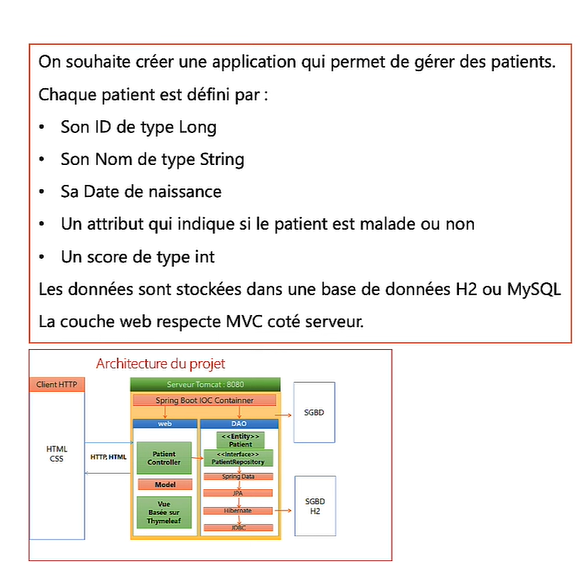

# Patients APP

## Technologies Utilisées

Ce projet **Patients APP** est développé avec **Spring Boot** version **3.4.0** et inclut les dépendances suivantes :

- **Spring Web** : pour créer des services web RESTful et gérer les requêtes HTTP.
- **Spring Data JPA** : pour interagir avec la base de données de manière simplifiée grâce à des abstractions sur JPA.
- **Thymeleaf** : un moteur de templates pour générer des pages HTML dynamiques.
- **Lombok** : pour réduire le code boilerplate (comme les getters, setters, constructeurs, etc.).
- **H2 Database** : une base de données relationnelle en mémoire utilisée pour les tests ou des configurations légères.

## Architecture du Projet

 

Author Amine Hmidani Filali

